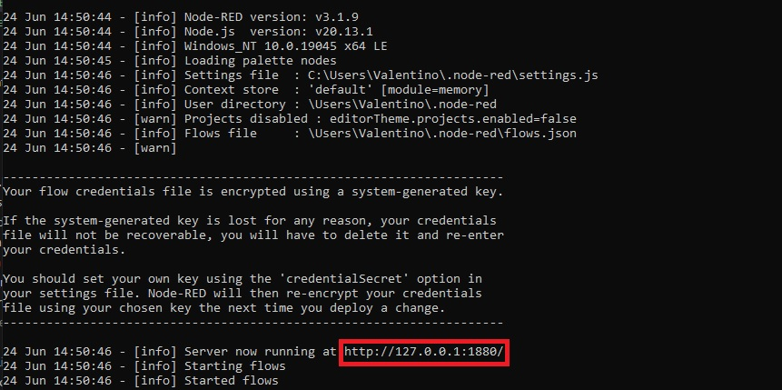

Para ejecutar esta API es necesario haber instalado previamente el paquete de Node.js 

## Ejecutar Node-red
para ejecutar Node-red tendremos que dirijirnos al cmd (ejecutarlo como administrador) para luego escribir el comando `Node-red`

La direccion ip que nos sale la copiaremos y pegaremos en google donde podremos importar el archivo `flows (3)` o copiar y pegar el contenido del archivo `script del node-red`

Ademas es probable que no funcione la base de datos porque tiene que ser creada previamente (revisar el directorio `BDSQL` ) y ademas tenemos que cambiarle el `host`, `el puerto` y en caso de que hayamos creado poner el usuario y constraseña

## Funciones 

### Funciones 1 y 2

Estas funciones son las que se encargan de crear variables donde se guardan los datos que envia el esp (en este caso el codigo de la tarjeta RFID) y hace un SELECT COUNT en el que busca dentro de la tabla `usuarios` de la base de datos la cantidad de campos que coinciden con esa variable (al estar la tabla usuarios normalizada, solo debe encontrar 1 o 0) luego manda ese 1 o 0 al topico RES/NODE al cual ya esta suscripto el ESP32

### Funcion 3

Esta Funcion crea una variable donde guarda el codigo RFID y hace un INSERT en la tabla `log` donde guarda la hora, fecha, el sector, y la tarjeta que se utilizo rellenando ese campo con la variable que creo 

### Funciones 4 y 5

Al igual que con las funciones 1 y 2 Estas funciones son las que se encargan de crear variables donde se guardan los datos que envia el esp (en este caso el password) y hace un SELECT COUNT en el que busca dentro de la tabla `usuarios` de la base de datos la cantidad de campos que coinciden con esa variable (al estar la tabla usuarios normalizada, solo debe encontrar 1 o 0) luego manda ese 1 o 0 al topico RES/NODE al cual ya esta suscripto el ESP32

### Funcion 6

Esta Funcion crea una variable donde guarda el password ingresado y hace un INSERT en la tabla `log` donde guarda la hora, fecha, el sector, y el password que se utilizo rellenando ese campo con la variable que creo 