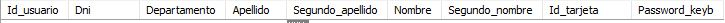
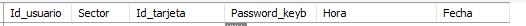
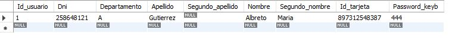

## ejemplo_trabajo

en esta Base de datos usamos 2 tablas las cuales son :

### usuarios

Esta vendria siendo la primera tabla. En esta encontramos varios campos de los cuales se pueden resaltar `Id_usuario` el cual es un campo que no hay que completar debido a que es nuestra clave primaria y es auto incremental, ademas encontramos campos como `Dni`, `Departamento`, `Apellido`, `Nombre` y los mas importantes `Id_tarjeta` y `Password_keyb` el cual no pueden quedar vacios ya que son los datos personales de las personas que ingresan con su tarjeta o contraseña previamente definida. Luego tambien estan los campos `Segundo_apellido` y `Segundo_nombre` los cuales si son posibles dejarlos nullos porque no toda persona cuenta con estos datos. Ademas es desde los campos de esta tabla donde el node-red ejecuta un SELECT donde busca los datos de la tarjeta o el teclado ingresados que coincidan con los ejecutados en el ESP

### Log

Esta tabla es en la que se registran todos los movimentos que ocurren. Ya sea una tarjeta valida, una invalida, un password valido o un password invalido ademas de describir la hora y dia en que ocurrieron y en que sector.

### Usando el ejemplo

Si ejecutamos el archivo `probar_BD.sql` nos deveria quedar la tabla usuarios asi, obviamente que los campos `Dni`, `Departamento`, `Apellido`, `Segundo_apellido`, `Nombre`, `Segundo_nombre` son personalizables a gusto pero los campos `Id_tarjeta` y `Password_keyb` son los que definen quien tiene acceso como no. Por lo que es muy importante recordar el password ingresado, como asi tambien recordar que tarjetas son registradas.
